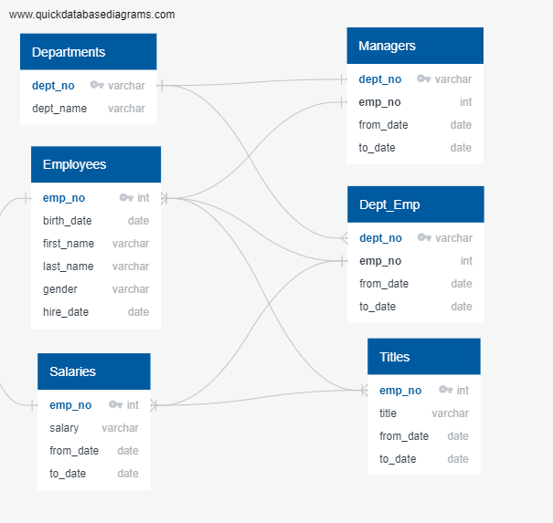
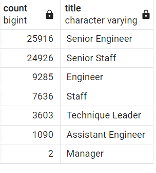

# Pewlett-Hackard-Analysis

## Overview

We are working to help the company look over its half million employee records to see who is retiring in the coming years and who would be in line to start a mentorship program now.  Along with this, we're providing some quick summary data tables showing how many retirees there will be for any given title. 

### Specific Data Tasks
To do this requires some joining of csv records that we were given (see image), along with some grouping and some filtering through those who no longer work for the company and/or who have held multiple titles over their time with the company (we only wanted their most recent/current title).

 

## Results

1. While there are over 130,000 rows of retirement records, we needed to create a new table that narrowed this number down to only one row per employee since there were many retiring employees who have help multiple titles during their time with the company.  This resulted in only 70,000 or so.

2. When we grouped the unique records by title, and ordered them by total counts of employees retiring with that title, we see the areas of coming vacancy very clearly.  Unless those titles are no longer needed in the company structure, PH will need a 20K new Senior Engineers and 20K Senior Staff soon!

3. Coming behind this "silver wave" are about 1500 employees who could potentially spend time in a mentorship program.  Most of them hold the same senior-level positions already and could spend the next 10 years before their retirement training up others within (and/or new hires) to fill positions.

4. Of all those retiring, it is interesting to note that only 2 hold the title of "manager".  This could be related to the way roles which are classified as management are named.  But it is worth noting that the purely managerial structure is in pretty solid shape to continue as is while other groups are not.

### Related Image

## Summary

### Response Questions

1. How many roles will need to be filled?  This depends on a directorial analysis of department and work structure first, to see whether these positions will be restructured or refilled.  But if all are to be filled as they are now, that leaves 72,458 results showing for those born 1/1/1962 through 12/31/1965.

2. Are there enough qualified, retirement-ready employees to mentor the next generation?  This is difficult to know without doing further analysis on the tables we made and also considering how many mentees we'd assign to each mentor.  At best, according to our table, each would have to oversee 50!

### Additional Queries

1.  As mentioned, we could do further sorting and counting of our mentors to find out how many are in each title and/or department and/or whether/where we might have holes that require outside hires.

2.  We could benefit from more general counts of department/title totals in the overall company to know proportionally which areas are hit the hardest and how many internal promotions are possible.